# Assignment 3: Process Mining Report
**Course:** 5,131: Introduction to Business Process Automation and Process Mining
**Date:** 2025-12-30


## Data Source
The small event log (`DhanaLoanApplication201607.xes`) was used for all analysis.

## Part 1: Exploratory Analysis
*`exploratory_analysis.py` was used to calculate these answers.*

### 1. Schemas
**a. Data inside "A_Create Application"**
The "A_Create Application" events were analyzed. They contain data like the timestamp, who did it (resource), and details about the case (loan goal, amount, type).

> **Script Output:**
> ```
> 1a. Attributes for 'A_Create Application': ['lifecycle:transition', 'time:timestamp', 'Action', 'org:resource', 'EventID', 'concept:name', 'EventOrigin', 'case:concept:name', 'case:variant', 'case:variant-index', 'case:creator', 'case:LoanGoal', 'case:ApplicationType', 'case:RequestedAmount']
> ```

**b. Missing values**
There are no missing values for these events. The data is complete.

> **Script Output:**
> ```
> 1b. Attributes with missing values in 'A_Create Application':
> Series([], dtype: int64)
> ```

**c. Re-used attributes**
There are 14 attributes that appear in all activities. These include standard things like the time and person acting, but also the Case ID and Loan Goal.

> **Script Output:**
> ```
> 1c. Attributes re-used across all activities (14): {'EventOrigin', 'case:ApplicationType', 'case:LoanGoal', 'case:variant', 'case:RequestedAmount', 'lifecycle:transition', 'case:creator', 'concept:name', 'time:timestamp', 'org:resource', 'case:variant-index', 'case:concept:name', 'EventID', 'Action'}
> ```

### 2. Inspect Case "Application_177461216"
**What happened in this case?**
This was a successful loan.
1. `User_1` created and submitted the application on Jan 23rd.
2. It was automatically checked ("Concept").
3. `User_37` accepted it and created an offer.
4. They sent the offer to the customer.
5. There was a "Call after offers" scheduled, but it got delayed (suspended) a few times.
6. Eventually, the documents were validated on Feb 2nd.
7. The offer was Accepted, and the loan became "Pending" (Success).

> **Script Output:**
> ```
>                         time:timestamp              concept:name lifecycle:transition org:resource
> 41431 2016-01-23 14:35:52.357000+00:00      A_Create Application             complete       User_1
> ...
> 41462 2016-02-02 10:52:51.871000+00:00                 A_Pending             complete      User_30
> ```

### 3. Top Three Loan Goals
Most people want money for:
1. Car (4104 applications)
2. Home improvement(2805 applications)
3. Existing loan takeover (2268 applications)

> **Script Output:**
> ```
> Top 3 Loan Goals:
> case:LoanGoal
> Car                       4104
> Home improvement          2805
> Existing loan takeover    2268
> Name: count, dtype: int64
> ```

### 4. Requested Amount Distribution
A histogram was created to see how much money people ask for.
*   **Observation 1:** Most people ask for small amounts (around €12,000).
*   **Observation 2:** Very few people ask for huge amounts (the tail goes to the right).
*   **Observation 3:** People like round numbers (e.g., €5,000, €10,000).

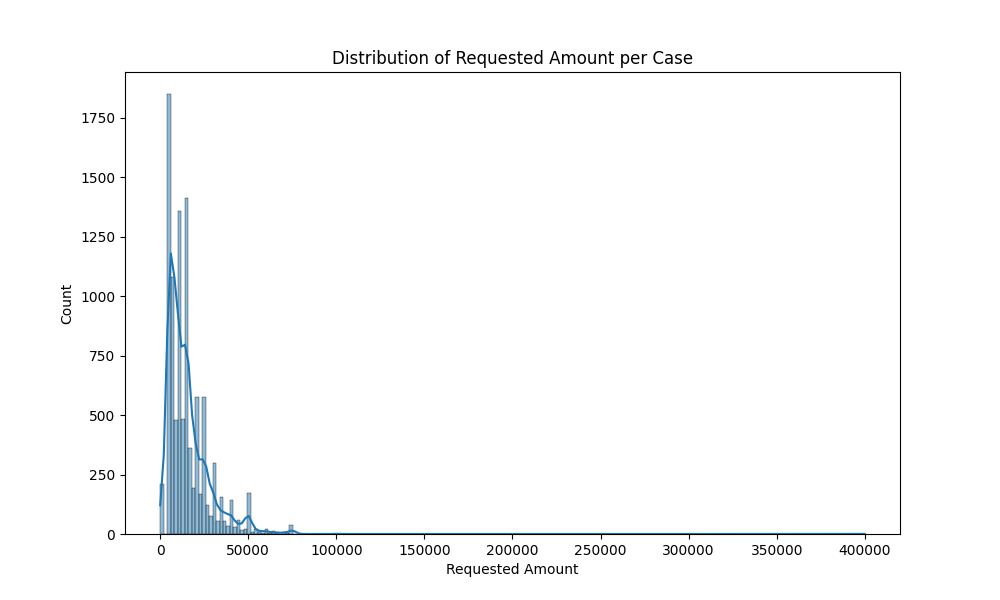

### 5. Requested Amount vs. Offered Amount
The requested amount was compared against the offered amount. Max offered amount per case is computed as the maximum over all offers linked to an application.
*   **Observation 1:** They almost always match! (Points are on the diagonal line).
*   **Observation 2:** Sometimes the bank offers less than requested (points below the line).

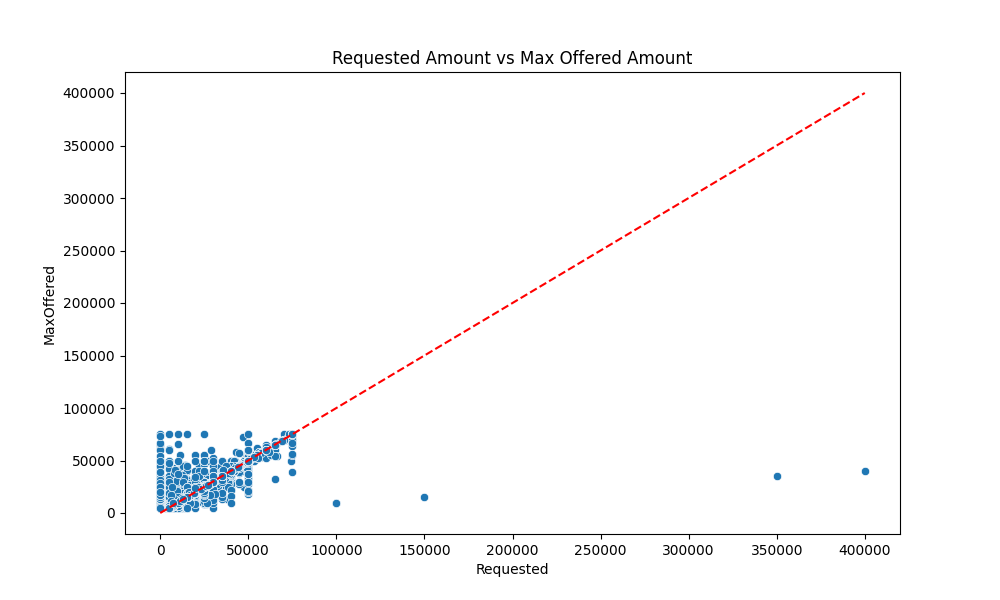

### 6. Credit Score vs. Monthly Cost
The relationship between credit score and monthly costs was analyzed. CreditScore and MonthlyCost aggregated at case level by mean per case.
*   **Result:** No, there is **no relation**. The dots are scattered. The monthly cost depends on the loan size, not the credit score.

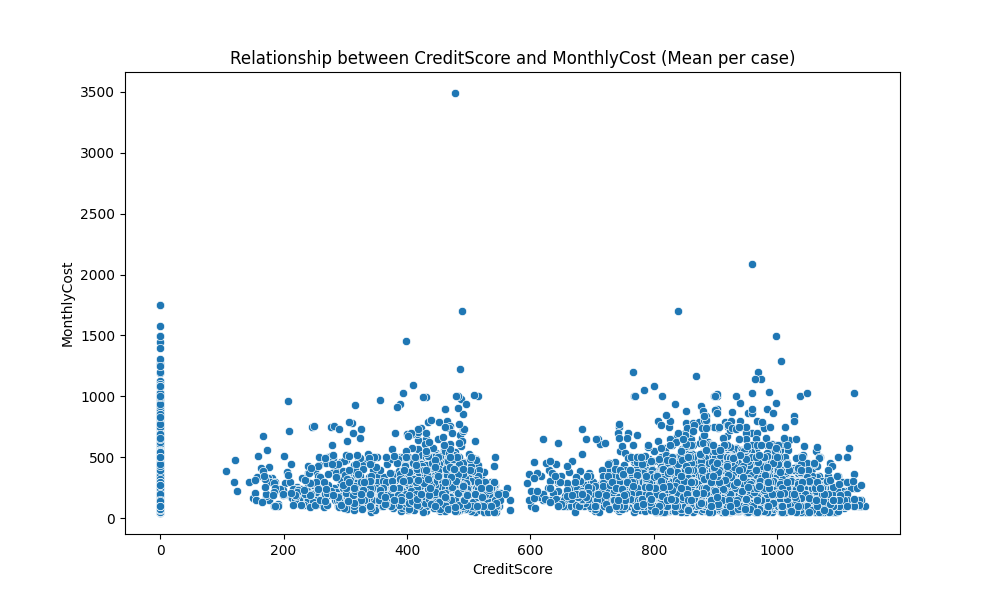


## Part 2: Discovery
*`discovery_analysis.py` was used for this part.*

### 7. Sequential Variants
This asks: "How many different paths do cases take?"
**a. Full Log:**
There are **5,470 different paths**. This is high! It means the process is very flexible and people do things in many different orders.

> **Script Output:**
> ```
> [Full Log] Number of sequential variants: 5470
> ```

**b. To cover 50% of cases:**
**576 different paths** are needed just to explain half of the cases. This confirms the process is complex.

> **Script Output:**
> ```
> [Full Log] Variants needed to cover 50% cases: 576 (10.53%)
> ```

**c. Only Loan Application (starts with "A_"):**
If Offers are ignored, there are only **60 paths**. Only **3 paths** are needed to cover 50% of cases.
*   **Takeaway:** The main loan process is simple. The complexity comes from the Offers.

> **Script Output:**
> ```
> [Loan App Lifecycle] Number of sequential variants: 60
> [Loan App Lifecycle] Variants needed to cover 50% cases: 3 (5.00%)
> ```

### 8. Loan Application Process Map
A map of the Loan process was generated.
*   **Observation 1:** The "Happy Path" is clear: Submitted -> Concept -> Accepted -> Complete.
*   **Observation 2:** Many applications skip "Submitted" and go straight to "Concept".
*   **Observation 3:** There is a big loop between "Validating" and "Incomplete". This means documents get rejected often, and customers have to fix them.

*   **Observation 3:** There is a loop between "Validating" and "Incomplete". This means documents get rejected often, and customers have to fix them.

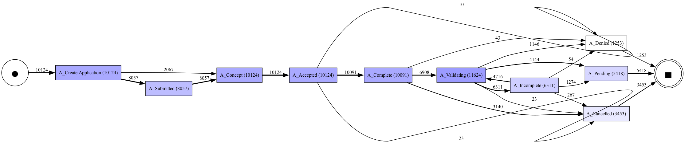

### 9. Offer Lifecycle Process Map
A map for the Offers was generated. Filter: O_* excluding O_Create Offer.
*   **Observation 1:** Valid offers go: Created -> Sent -> Returned -> Accepted.
*   **Observation 2:** Many offers get Cancelled.
*   **Observation 3:** Some offers are sent, then "Created" again. Maybe a re-negotiation? A mistake?

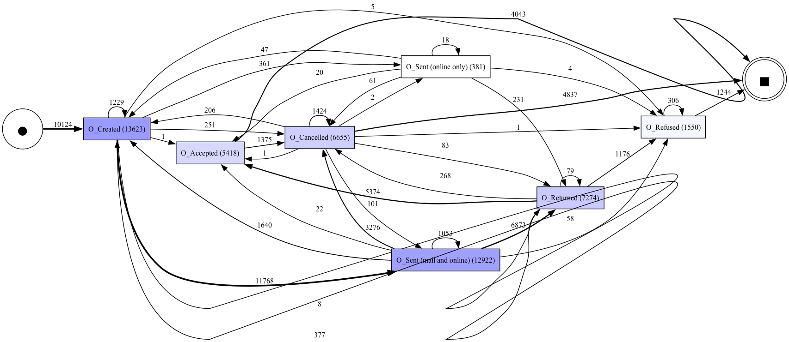


## Part 3: KPIs and Outcomes
*The Python script `conformance_analysis.py` was used here.*

### 10. Outcomes
How do cases end?
- **Success (Pending):** 5,418 cases (53.5%) - More than half get the loan!
- **Cancelled:** 3,453 cases (34.1%) - Many people drop out.
- **Denied:** 1,253 cases (12.4%) - Some are rejected by the bank.

> **Script Output:**
> ```
> Outcome Distribution:
> Pending      5418
> Cancelled    3453
> Denied       1253
> Name: count, dtype: int64
> ```

### 11. Dashboard Ideas
If I were a manager, I would want these charts:
1.  **Weekly Status Chart:** A bar chart showing how many loans were Pending, Cancelled, or Denied each week. (Helps spot trends).
2.  **"Validating" Bottleneck Chart:** A heatmap showing when the validation team is slowest. (Helps fix the rework problem).


## Part 4: Conformance Checking
*`conformance_analysis.py` and `check_rule_d.py` were used to check the rules.*

### 12. Checking the Rules
5 strict rules were checked.
**a. Pending -> Offer Accepted:** **0 violations.** (No violations found).
**b. Cancelled -> Offer Cancelled:** **0 violations.** (No violations found).
**c. Denied -> Offer Refused:** **9 violations.** Very rare error. (e.g., `Application_267100792` where `A_Denied` is followed by `O_Refused` same second).
**d. Incomplete -> Call Incomplete:** **0 violations.** (No violations found). *The activity is named "W_Call incomplete files", not just "incomplete".*
**e. Offer Sent -> Call After Offers:** **1 violation.** (e.g., `Application_1039537740`). The follow-up call is consistently adhered to, with only one exception. This rule used `O_Sent (mail and online)` as the trigger.

> **Script Output:**
> ```
> Rule a: 0 violations.
> Rule b: 0 violations.
> Rule c: 9 violations.
> Rule d Violations (Corrected): 0
> Rule e: 1 violations.
> ```
### 13. Service Level Objectives (SLOs)
**a. Speed of Success:**
The rule is: "Finish successful loans in 28 days."
*   **Result:** 623 cases failed this (11.5%). The bank is mostly fast enough, but 1 in 10 customers wait too long.

**b. Speed of Rejection (Takeover loans):**
The rule is: "Reject takeover loans within 14 days."
*   **Result:** 135 cases failed this (44%). The bank is too slow at rejecting these customers.

> **Script Output:**
> ```
> SLO a violations: 623 (Total A_Pending: 5418)
> SLO b violations: 135 (Total Applicable: 308)
> ```

### 14. Offer Lifecycle Conformance
**a. The Model**
(See the screenshot below for the diagram).
Expected path: Created -> Sent -> Returned -> Accepted (or Refused/Cancelled).

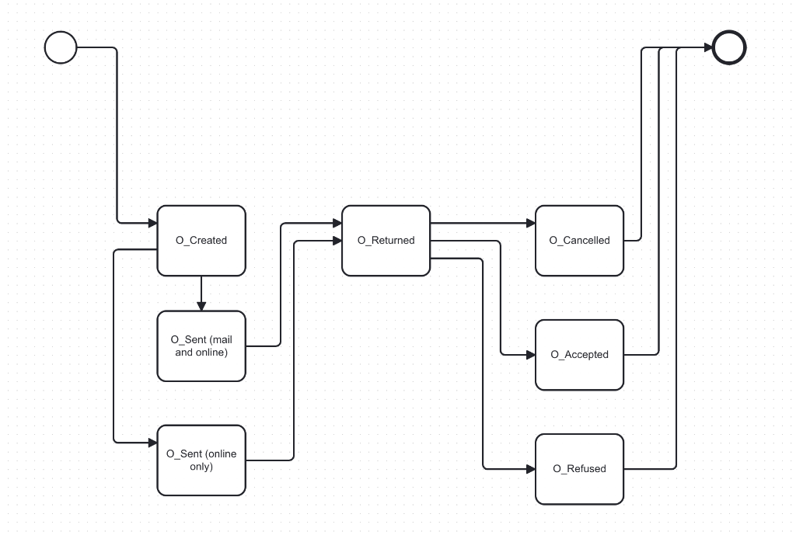

**b. Checking the Log**
*`conformance_offer_v2.py` was used.*
*   **Violations:** 3,326 offers (about 12%) did not follow the model.

**c. Concrete Example (Offer_1669071500)**
One specific violating case is `Offer_1669071500`.
*   **Sequence:** `O_Created -> O_Sent (mail and online) -> O_Refused`.
*   **Problem:** It skips the `O_Returned` step.
*   **Model vs. Log Error:** This is likely a **Model Error**. It is perfectly reasonable for a customer to refuse an offer (e.g., by phone) without formally returning the document. The model wasn't thought through by assuming `O_Returned` is mandatory.

> **Script Output:**
> ```
> Found Violation Case: Offer_1669071500
> Sequence: ['O_Created', 'O_Sent (mail and online)', 'O_Refused']
> Fit: False
> ```


## Part 5: Performance Mining
*`performance_analysis.py` was used for all these stats.*

### 15. Rework (doing things twice)
**a. Where?** In the "Validating" and "Incomplete" steps.
**b. How much?** **35%** of cases have this problem.
**c. Impact?**
*   **Successful (No Rework):** Mean = 14.9 days, **Median = 12.6 days**.
*   **Successful (Rework):** Mean = 18.4 days, **Median = 14.9 days**.
*   **Result:** Rework adds about **2-3 days** to the median process duration.

> **Script Output:**
> ```
> 15c. Cycle Time Successful NO Rework: Mean=14 days..., Median=12 days...
> 15c. Cycle Time Successful WITH Rework: Mean=18 days..., Median=14 days...
> ```

### 16. Offer Rework
**a. Repetitions:** 0 repetitions were found inside a single Offer ID.
**b. Results:**
*   40% Accepted
*   49% Cancelled
*   11% Refused
**c. Offers per case:** Usually 1. Average is 1.35.

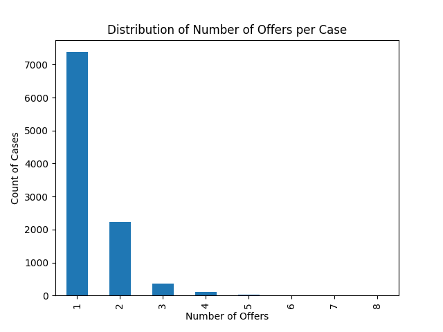

### 17. Workflow Delays
The "Workflow" events (W_) were analyzed.
*   **Observation 1:** The most common transition is **"Suspend"** (70,446 times). This confirms that waiting for customers is the biggest part of the job.
*   **Observation 2:** The transition **"ate_abort"** happens 25,223 times. This might mean that the system Activity Monitoring automatically aborted a task, likely because it timed out or was superseded by another event.

> **Script Output:**
> ```
> Top Transitions:
> suspend      70446
> ate_abort    25223
> ```

### 18. Case Stats
**a. Arrivals:** New applications come in constantly.
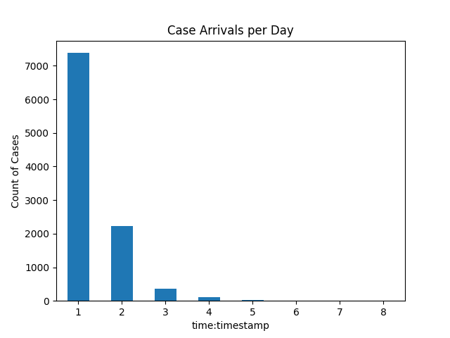

**b. Case Closures:**
Closures follow a similar pattern to arrivals but are slightly delayed.
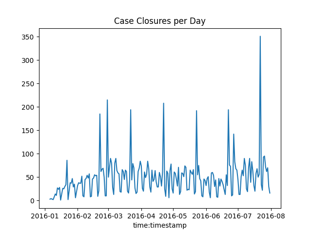

**c. Active Cases (Work in Progress):**
The number of active cases peaked around March-April.
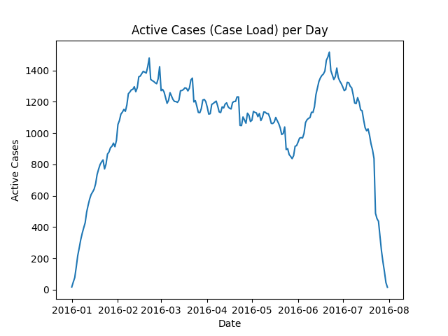

**d. Event Load:**
On average, the bank processes **1,806 events per day**, but this can spike up to 3,867 events. This shows the workload is quite variable.
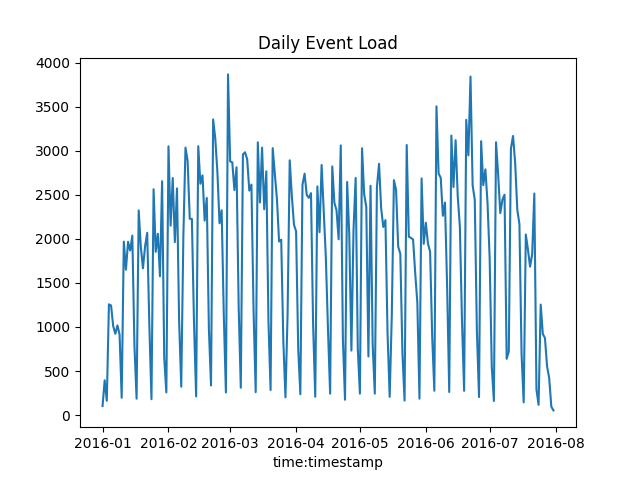

**e. Batching:**
It was observed that `W_Validate application` is often done in batches (many tasks done in <2 seconds). This suggests employees save up the work and do it all at once, or a system does it.

### 19. Cycle Time
**a. Average time:** 21 days (Median: 17 days).
**b. Long cases:** The really long cases are the ones that get stuck in the "Validation Loop".
**c. Waiting vs Working:** The cycle time is mostly **Waiting** (Suspended), not active working.
**e. Cancellation Delay:**
For cases that get cancelled, there is a delay of **~21 days** (Mean) or **~27 days** (Median) between the last contact and the actual cancellation.
*   **Interpretation:** The bank or customer waits nearly a month before "giving up". This could be automated to cancel sooner (e.g., after 14 days of silence) to clean up the books.

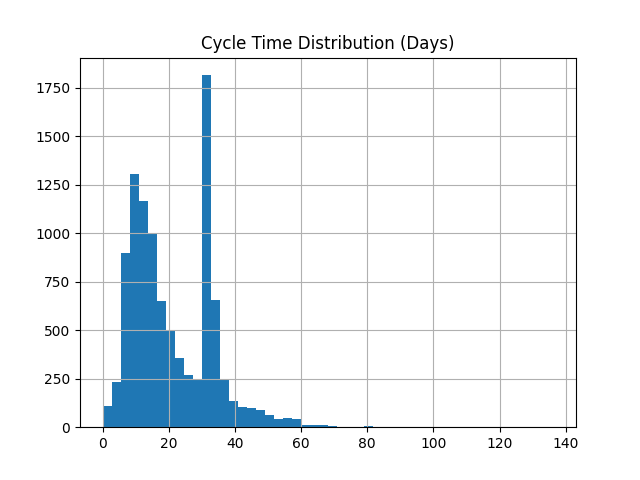

> **Script Output:**
> ```
> 19e. Delay before Cancellation: Mean=20.92 days, Median=26.71 days
> ```

### 20. Specific Conditions
**a. Denied:** 1,253 cases. (Example: `Application_1691306052`).
**b. Cancelled:** 3,453 cases. (Example: `Application_828200680`).
**c. Fraud:** 81 cases. (Example: `Application_2120232738`).
   *   **ROI Idea:** Automated fraud flagging. **Risk:** False positives blocking real customers.

**d. Successful with Multiple Offers (>1 week gap):**
*   **Count:** 521 cases. (Example: `Application_1003879772`).
*   **ROI Idea:** These customers are "shoppers" who come back for a better deal. A "Best Price Guarantee" could be offered immediately to prevent them from waiting a week for a second offer.
*   **Risk:** We might lower our margin unnecessarily if they would have accepted the first offer anyway.

**e. Cancelled with Call After Offers (Different Officers):**
*   **Count:** 3,405 cases. (Example: `Application_1000311556`).
*   **ROI Idea:** A huge number of cancelled cases involve multiple officers trying to call. This is wasted effort. Assign one "Case Owner" to handle all calls for a specific client.
*   **Risk:** If that one owner is sick/busy, the customer gets no contact at all.

> **Script Output:**
> ```
> 20d. Successful, >1 offer, >1 week gap: 521 cases. Example: Application_1003879772
> 20e. Cancelled, different officers on call: 3405 cases. Example: Application_1000311556
> ```
